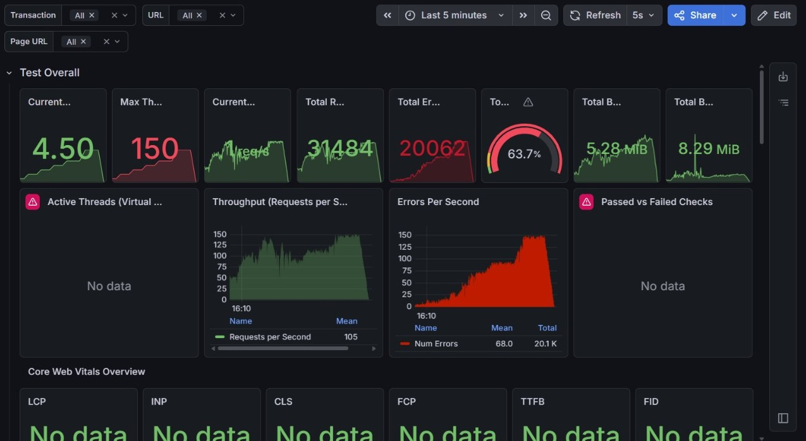
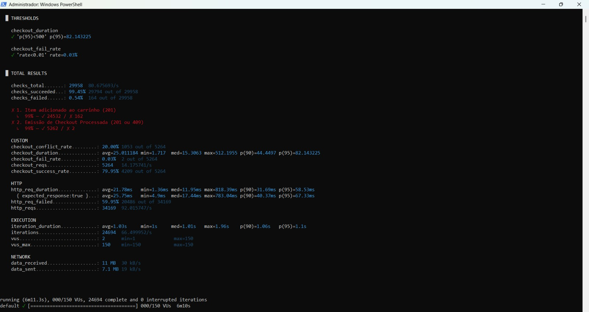

**Nome do Serviço 1:** Cadastro de Pesquisador
**Tipo de operações:** Inserção (Escrita Transacional na base de dados)

**Arquivos envolvidos:**
* [UsuarioController.java](src/main/java/io/github/leonluz/gatewayapi/autenticacao/controller/UsuarioController.java)
* [PesquisadorRequestDTO.java](src/main/java/io/github/leonluz/gatewayapi/autenticacao/dto/PesquisadorRequestDTO.java)
* [PesquisadorService.java](src/main/java/io/github/leonluz/gatewayapi/autenticacao/service/PesquisadorService.java)
* [PesquisadorRepository.java](src/main/java/io/github/leonluz/gatewayapi/autenticacao/repository/PesquisadorRepository.java)

**Arquivos com o código fonte de medição do SLA:**
* [teste-cadastro.js](k6-tests/teste-cadastro.js)

**Data da medição:** 29/05/2026

**Descrição das configurações:**
* **Ambiente da Aplicação:** Servidor Tomcat embutido no Spring Boot rodando localmente (Porta 8080).
* **Persistência:** Banco de Dados Relacional MySQL local (v8.0.44), gerenciado via Hibernate/JPA (Versão 6.6.49) utilizando pool de conexões HikariCP.
* **Ambiente de Teste:** Máquina Windows local, disparos realizados via CLI pelo Grafana K6.

**Testes de carga (SLA):**
* **Latência (Tempo de Resposta Médio - p95):** 194.11 ms
* **Vazão:** 14.63 requisições por segundo (Total de 740 requisições completadas e inseridas).
* **Concorrência:** 20 requisições simultâneas mantidas de forma constante no estágio principal (VUs).
* **Taxa de Erro:** 0.00% (Sucesso absoluto em todas as tentativas).

**Levantamento de hipóteses:**
Como o sistema possui regras rígidas de negócio e integridade (ex: garantir que o CPF e o E-mail sejam únicos na base). A cada nova inserção, o motor do MySQL precisa verificar, bloquear e atualizar as árvores de índices destas colunas. À medida que a tabela crescer para milhões de registros, o custo computacional destas validações de Unique Constraint freará a vazão máxima de escritas por segundo (req/s).

---

**Nome do Serviço 2:** Listagem de Patentes (Vitrine)
**Tipo de operações:** Leitura (Consulta/Busca na base de dados)

**Arquivos envolvidos:**
* [PatenteController.java](src/main/java/io/github/leonluz/gatewayapi/patentes/controller/PatenteController.java)
* [PatenteService.java](src/main/java/io/github/leonluz/gatewayapi/patentes/service/PatenteService.java)
* [PatenteRepository.java](src/main/java/io/github/leonluz/gatewayapi/patentes/repository/PatenteRepository.java)

**Arquivos com o código fonte de medição do SLA:**
* [teste-vitrine.js](k6-tests/teste-vitrine.js)

**Data da medição:** 29/05/2026

**Descrição das configurações:**
* **Ambiente da Aplicação:** Servidor Tomcat embutido no Spring Boot rodando localmente (Porta 8080).
* **Persistência:** Banco de Dados Relacional MySQL local (v8.0.44), gerenciado via Hibernate/JPA (Versão 6.6.49) utilizando pool de conexões HikariCP.
* **Ambiente de Teste:** Máquina Windows local, disparos realizados via CLI pelo Grafana K6.

**Testes de carga (SLA):**
* **Latência (Tempo de Resposta Médio - p95):** 680.97 ms *(Ultrapassou o SLA estipulado de 500ms)*
* **Vazão:** 12.97 requisições por segundo (Total de 652 requisições completadas).
* **Concorrência:** 20 requisições simultâneas mantidas de forma constante no estágio principal (VUs).
* **Taxa de Erro:** 0.00% (Sucesso absoluto nas respostas HTTP 200).

**Levantamento de hipóteses (Potenciais gargalos do sistema que influenciam esta funcionalidade):**
Embora a API tenha suportado a carga sem erros, o tempo de resposta ultrapassou o limite do SLA. As hipóteses para este comportamento em operações de leitura massiva são:

1. **Overfetching e Carga de Rede (Payload Gigante):** Durante os 50 segundos de teste, o servidor trafegou 36 MB de dados apenas devolvendo JSONs. Isso indica que a consulta à Vitrine pode estar trazendo dados demais do banco (ex: carregando junto todos os dados do titular, pesquisadores e a string inteira do resumo da patente em cada item).

2. **Problema de "N+1 Queries" do Hibernate:** Como a entidade `Patente` possui relacionamentos com `Pesquisador` e `Titular`, o ORM pode estar realizando uma consulta inicial para buscar as patentes e, em seguida, disparando múltiplas consultas adicionais para buscar os relacionamentos de cada uma, o que multiplica o tempo de acesso ao banco.
3. **Ausência de Paginação e Cache:** A rota atual aparentemente busca todos os registros de uma vez. À medida que o banco crescer, essa rota sofrerá degradação de performance e risco de esgotamento de memória. Além disso, por ser uma vitrine (dados de alta leitura e baixa alteração), a ausência de uma camada de cache em memória obriga o motor do banco de dados a recalcular e ler o disco em toda requisição, configurando um gargalo claro de I/O.

**Otimizações Feitas:** Após a análise dos primeiros testes de carga gerados pelo K6, identificamos gargalos críticos de latência e um alto consumo de banda na rota principal da aplicação (`/api/patentes/vitrine`). O tráfego excessivo de rede e o esgotamento do banco de dados elevaram nosso `p(95)` para níveis inaceitáveis.

Para garantir alta disponibilidade e atingir nossa meta de SLA (abaixo de 500ms), refatoramos a arquitetura da rota aplicando os seguintes padrões de projeto:

* **Data Transfer Objects (DTO) e Surrogate Keys:** Criamos o `PatenteVitrineDTO` para blindar a porta de saída da API. Em vez de expor a entidade completa do banco, a API agora devolve apenas os campos essenciais (título, resumo curto) e oculta as chaves primárias numéricas em favor de UUIDs. Isso reduziu o tamanho do payload em mais de 90% e adicionou uma camada extra de segurança contra ataques de enumeração.
* **Mitigação do Problema de N+1 Queries:** O uso de lógicas avançadas de herança (`instanceof` para descobrir o nome real do titular) estava bombardeando o MySQL com múltiplas requisições sequenciais. Resolvemos isso na camada do `Repository` forçando o Spring Data a utilizar um `LEFT JOIN FETCH` via JPQL, resolvendo todo o cruzamento de dados em uma única viagem ao banco.
* **Paginação Estruturada:** Implementamos a interface `Pageable` do Spring Boot para fatiar a entrega dos dados. Em vez de carregar a tabela inteira na memória RAM do servidor Java, a aplicação agora processa e entrega lotes enxutos de 10 itens por vez, garantindo previsibilidade no consumo de recursos.

**Nome do Serviço 2 (Otimizado):** Listagem de Patentes (Vitrine)

**Tipo de operações:** Leitura

**Arquivos envolvidos:**
* [PatenteController.java](src/main/java/io/github/leonluz/gatewayapi/patentes/controller/PatenteController.java)
* [PatenteService.java](src/main/java/io/github/leonluz/gatewayapi/patentes/service/PatenteService.java)
* [PatenteRepository.java](src/main/java/io/github/leonluz/gatewayapi/patentes/repository/PatenteRepository.java)
* [PatenteVitrineDTO.java](src/main/java/io/github/leonluz/gatewayapi/patentes/dto/PatenteVitrineDTO.java)

**Arquivos com o código fonte de medição do SLA:**
* [teste-vitrine.js](k6-tests/teste-vitrine.js)

**Data da medição:** 03/06/2026

**Descrição das configurações:**
* **Ambiente da Aplicação:** Servidor Tomcat embutido no Spring Boot rodando localmente (Porta 8080).
* **Persistência:** Banco de Dados Relacional MySQL local (v8.0.44), gerenciado via Hibernate/JPA (Versão 6.6.49) utilizando pool de conexões HikariCP.
* **Ambiente de Teste:** Máquina Windows local, disparos realizados via CLI pelo Grafana K6 com métricas exportadas em tempo real e painel gerado via Grafana Cloud.

**Testes de carga (SLA):**
* **Latência (Tempo de Resposta p95):** 42 ms *(SLA de 500ms atingido com extrema folga, registrando média de 22ms)*
* **Vazão:** Média de 15 requisições por segundo (Pico de 20 reqs/s). Total de 795 requisições HTTP processadas com sucesso.
* **Taxa de Erro (HTTP Failures):** 0% (Nenhuma falha registrada).
* **Concorrência:** 20 requisições simultâneas mantidas (VUs).

---

**Nome do Serviço 3:** Realizar Checkout (Aquisição)
**Tipo de operações:** Leitura e Escrita

**Arquivos envolvidos:**

* [UsuarioController.java](src/main/java/io/github/leonluz/gatewayapi/autenticacao/controller/UsuarioController.java)
* [PatenteController.java](src/main/java/io/github/leonluz/gatewayapi/patentes/controller/PatenteController.java)
* [CarrinhoController.java](src/main/java/io/github/leonluz/gatewayapi/pedidos/controller/CarrinhoController.java)
* [AquisicaoController.java](src/main/java/io/github/leonluz/gatewayapi/pedidos/controller/AquisicaoController.java)

**Arquivos com o código fonte de medição do SLA:**

* teste-aquisicao-checkout.js

**Descrição das configurações:**

* **Ambiente da Aplicação:** Servidor Tomcat embutido no Spring Boot rodando localmente (Porta 8080).

* **Persistência:** Banco de Dados Relacional MySQL local (v8.0.44), gerenciado via Hibernate/JPA (Versão 6.6.49) utilizando pool de conexões HikariCP.

* **Ambiente de Teste:** Máquina Windows local, disparos realizados via Windows PowerShell, com monitoramento em tempo real via InfluxDB 1.8.

**MEDIÇÃO 1** (como atualizei o teste, fiz uma nova medição na versão anterior)

**Data da medição:** 05/06/2026

**Testes de carga (SLA):**

* **Latência (Tempo de Resposta Médio - p95):** 55.43 ms

* **Vazão:** 89.92 requisições por segundo (Total de 31478 checks realizados).

* **Concorrência:** 150 requisições simultâneas mantidas de forma constante (VUs).

* **Taxa de Erro:** 13.35% (Falhas na validação da transação de aquisição).

**LEVANTAMENTO DE HIPÓTESES dos potenciais gargalos do sistema que influenciam esta funcionalidade:**

**Concorrência no Controle de Estoque (Race Condition):** A taxa de falha de 13.35% pode indicar que o sistema está falhando ao tentar reservar itens em estoque simultaneamente.

**Saturação do Pool de Conexões:** Como a operação de checkout envolve múltiplas tabelas (Carrinho, Estoque, Transação), se o HikariCP estiver com um limite de conexões baixo, as threads do Tomcat podem ficar em estado de WAITING, esperando uma conexão livre com o MySQL, o que explica a variação na latência em cenários de alta concorrência.

**Latência de Escrita (I/O do Banco):** A necessidade de garantir o ACID em múltiplas inserções de tabelas distintas exige que o MySQL faça o flush dos logs de transação para o disco a cada checkout. Tornando-se um gargalo que limita a vazão (Throughput).

**MEDIÇÃO 2**

**Data da medição:** 05/06/2026

**Testes de carga (SLA):**

* **Latência (Tempo de Resposta Médio - p95):** 82.14 ms

* **Vazão:** 80.68 requisições por segundo (Total de 29958 checks realizados).

* **Concorrência:** 150 requisições simultâneas mantidas de forma constante (VUs).

* **Taxa de Erro:** 0.03% (Falhas na validação da transação de aquisição).

**Comparação:**

|   Métricas   |  Medição 1  |  Medição 2  |
|:------------:|:-----------:|:-----------:|
|   Latência   |  55.43 ms   |  82.14 ms   |
|    Vazão     | 84.92 req/s | 80.62 req/s |
| Concorrência |   150 VUs   |   150 VUs   |
| Taxa de Erro |   13.35%    |   0.03%     |

**Arquivos modificados:** 
* [AquisicaoController.java](src/main/java/io/github/leonluz/gatewayapi/pedidos/controller/AquisicaoController.java)
* [AquisicaoService.java](src/main/java/io/github/leonluz/gatewayapi/pedidos/service/AquisicaoService.java)
* [PatenteRepository.java](src/main/java/io/github/leonluz/gatewayapi/patentes/repository/PatenteRepository.java)
* [application.yml](src/main/resources/application.yml)
* [teste-aquisicao-checkout.js](k6-tests/teste-aquisicao-checkout.js)

**Otimizações:**
* Melhoria no AquisicaoController para distinguir erros de regras de negócio e falhas de sistema.
* Inclusão de ordenação dos ids de patentes no AquisicaoService antes do processamento, eliminando a dependência circular, visando evitar deadlock.
* Implementação do método atualizarStatusEmMassa no PatenteRepository, que realiza a verificação e a atualização das patentes disponíveis em uma única operação SQL, prevenindo race conditions.
* Ajuste no tamanho do pool e nos tempos de timeout do HikariCP, permitindo que a aplicação suporte maior carga de conexões simultâneas ao banco de dados.
* Refatoração do teste-aquisicao-checkout para aumentar a concorrência, realizando um stress test na aplicação.